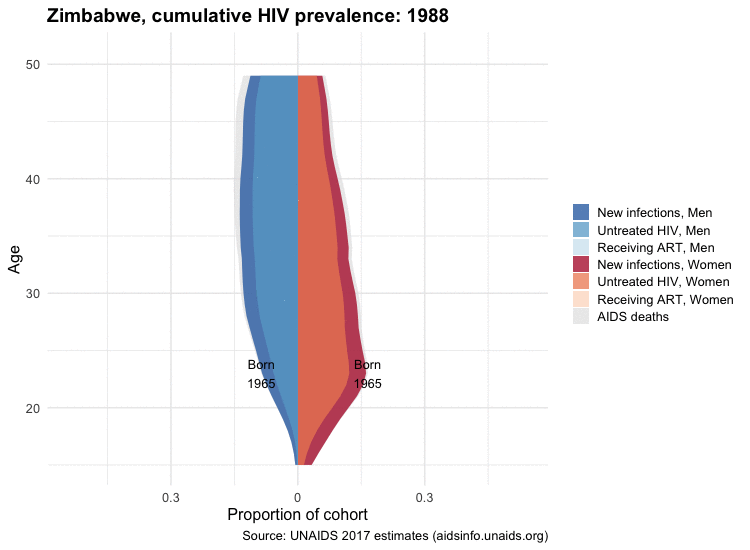
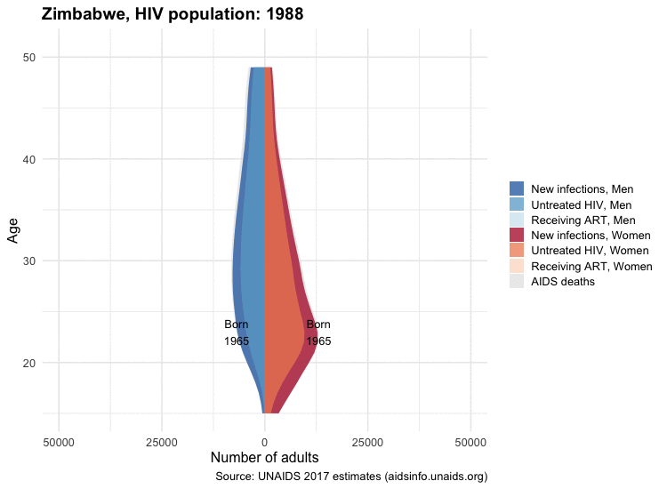

## Animated Spectrum HIV population, Zimbabwe

A distinctly demographic view at the course and progress against the HIV epidemic in sub-Saharan Africa, in memory of Basia Zaba.

Thanks to [@kjhealy](https://github.com/kjhealy/england_wales_pop) for example animation code.
